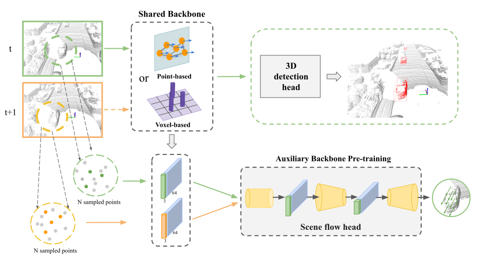

# 3D Object Detection with a Self-supervised Lidar Scene Flow Backbone
<b>3D Object Detection with a Self-supervised Lidar Scene Flow Backbone</b>

This repository contains the implementation for [3D Object Detection with a Self-supervised Lidar Scene Flow Backbone](https://arxiv.org/abs/2205.00705). 



## Introduction

In this work, we propose using a self-supervised training strategy to learn a general point cloud backbone model for downstream 3D vision tasks. 3D scene flow can be estimated with self-supervised learning using cycle consistency, which removes labelled data requirements. Moreover, the perception of objects in the traffic scenarios heavily relies on making sense of the sparse data in the spatio-temporal context. Our main contribution leverages learned flow and motion representations and combines a self-supervised backbone with a 3D detection head focusing mainly on the relation between the scene flow and detection tasks. In this way, self-supervised scene flow training constructs point motion features in the backbone, which help distinguish objects based on their different motion patterns used with a 3D detection head.

We evaluate our method on [Point-GNN](https://openaccess.thecvf.com/content_CVPR_2020/papers/Shi_Point-GNN_Graph_Neural_Network_for_3D_Object_Detection_in_a_CVPR_2020_paper.pdf), [PointPillars](https://openaccess.thecvf.com/content_CVPR_2019/papers/Lang_PointPillars_Fast_Encoders_for_Object_Detection_From_Point_Clouds_CVPR_2019_paper.pdf), [CenterPoint](https://openaccess.thecvf.com/content/CVPR2021/papers/Yin_Center-Based_3D_Object_Detection_and_Tracking_CVPR_2021_paper.pdf), and [SSN](https://link.springer.com/chapter/10.1007/978-3-030-58595-2_35) 3D detectors. 

For our self-supervised scene flow implementation on Point-GNN, please refer to the `pointgnn` folder. For the rest of the 3D detectors, please check `mmdetection3d` folder for details. 

## Citation
```
@article{erccelik20223d,
  title={3D Object Detection with a Self-supervised Lidar Scene Flow Backbone},
  author={Er{\c{c}}elik, Eme{\c{c}} and Yurtsever, Ekim and Liu, Mingyu and Yang, Zhijie and Zhang, Hanzhen and Top{\c{c}}am, P{\i}nar and Listl, Maximilian and {\c{C}}ayl{\i}, Y{\i}lmaz Kaan and Knoll, Alois},
  journal={arXiv preprint arXiv:2205.00705},
  year={2022}
}
```
## Dataset
|        | Point-GNN | PointPillars | CenterPoint | SSN |
|--------|:---------:|:------------:|:-----------:|:---:|
|KITTI   | ✓         | ✗            | ✗           | ✗   |
|nuScenes| ✗         | ✓            | ✓           | ✓   |

## Acknowledgement
This repository is coded on top of [Point-GNN](https://github.com/WeijingShi/Point-GNN), [FlowNet3D](https://github.com/xingyul/flownet3d), [Just Go with the Flow: Self-supervised Scene Flow Estimation](https://github.com/HimangiM/Just-Go-with-the-Flow-Self-Supervised-Scene-Flow-Estimation), and [mmdetection3D](https://github.com/open-mmlab/mmdetection3d).
